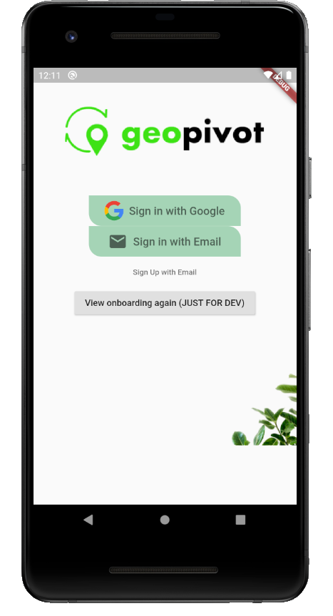
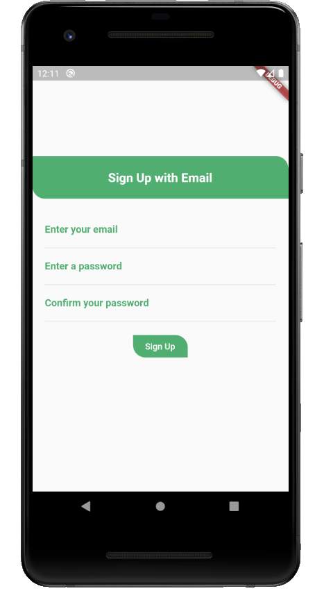
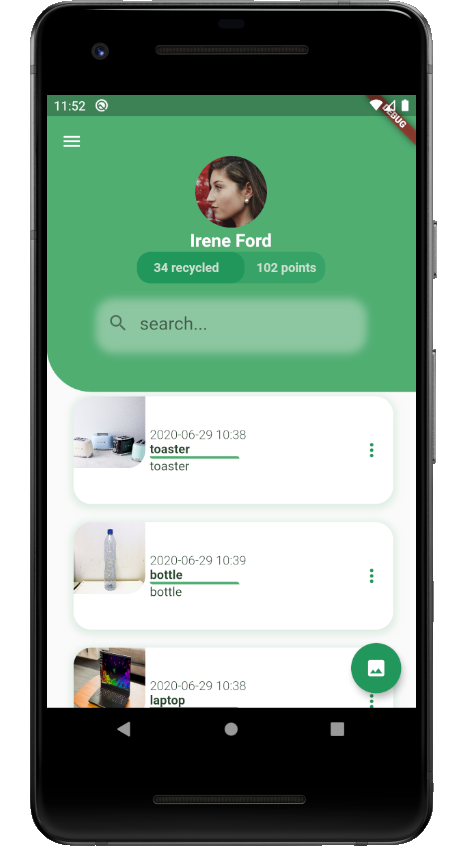
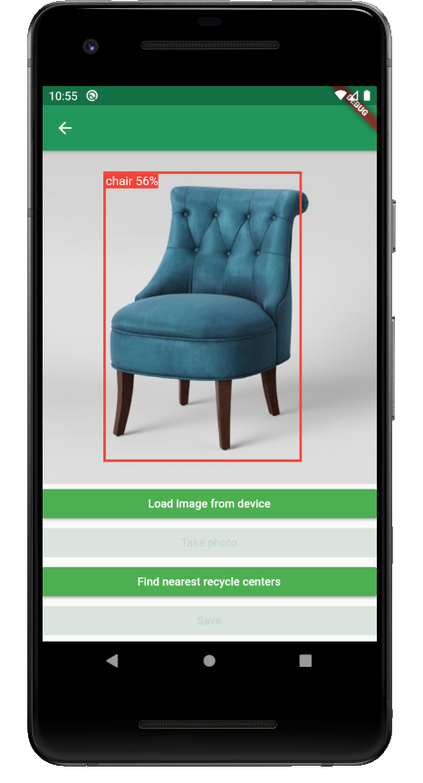
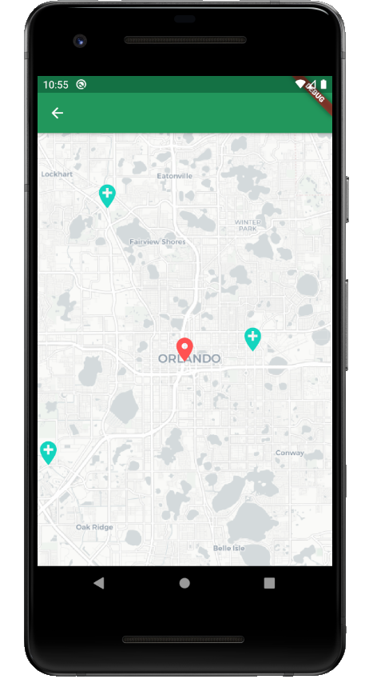

# Geopivot Mobile App   
A Recycling Centers and Services Mobile App

## Contents

- [Pitch](#Pitch)
- [Additional Information](#Additional-Information)
- [Development notes](#Development-notes)
    - [How to run things locally](#How-to-run-things-locally)
    - [Firebase](#Firebase)
    - [Android](#Android)
    - [Code Structure](#Code-Structure)
- [Tags](#Tags)

## Pitch

GeoPivot is powered by AI, Machine Learning, [earth911.com](earth911.com) data and mobile technologies to bring the convenience of recycling to people's homes.

| | | |
| :-----------: | :-----------: | :-----------: |
| Join  | Sign up | Introduction |
|  |  |  |
| Your Dashboard  | Detection | Recycling Centres |
|  |  |  |

Check out our flutter hackathon presentation trailer:

[](https://youtu.be/mo0US3lpGYI)


## Additional Information

Have you ever wondered how many waste are generated worldwide. A recent article from Recycling International states that more than 2 billion tonnes of municipal solid waste are generated worldwide per annum and only less than 20% of this is recycled.

In the top 20 countries for waste generator per capita worldwide, the US ranked 12th place with each citizen producing an average of 808kg per year. About 80% of what Americans throw away is recyclable, yet the recycling rate is only 28%.
It begs the question to ask why people are not doing more to recycle their waste?

First, it is difficult to identify what can and cannot be recycled. There are so many different kinds of paper goods, plastics, and metals, and worst of all, so many things that are combinations of materials that no list could possibly include every possible case.

Secondly, each recycle centre have their specific regulations depending on their locations and can be challenging for people to keep up.

GeoPivot project addresses these recycling woes. The project combines the power of Machine Learning, the vast recycling centre database from earth911, firebase - Google's mobile platform for quick app deployment and other technologies to bring the convenience of recycling to people's homes

Worldwide it is difficult to identify what can and cannot be recycled and where.
GeoPivot makes recycling easier, allowing users to take/upload pictures with mobile phones. It uses Tensorflow object detection, Earth911 data, Flutter maps to enable accurate prediction of images for recycling and show nearest recycle centre. The application is secure, using Firebase authentication for email/password and Goole sign-in. GeoPivot is tested and deployed to both Andriod and ios platforms.

## Technical Details

- for Object Detection we have integrated Tensorflow Lite TiniyYoloV2
- For data-models, stubs and explorations we  have used Earth911 API
- Maps are supported by Flutter Map with Open Street Maps
- for Authentication we use  Firebase Authentication with supported flows for Email/Password  and Google sign-in
- For state management we’ve implemented the provider pattern
- We are sharing a theme cross the entire app to enable easier customisations 
- The code has been structured into small manageable widgets of different types
- Deployed and tested on both iOS and Android platforms

## Development notes 

### How to run things locally

- To contribute or even to test/run locally this project we recommend the following setup (based `flutter doctor -v` , but removed user specific):
```
[✓] Flutter (Channel stable, v1.17.5, on Mac OS X 10.15.4 19E287, locale en-GB)
    • Flutter version 1.17.5
    • Framework revision 8af6b2f038 (5 days ago), 2020-06-30 12:53:55 -0700
    • Engine revision ee76268252
    • Dart version 2.8.4

[✓] Android toolchain - develop for Android devices (Android SDK version 29.0.3)
    • Android SDK
    • Platform android-29, build-tools 29.0.3
    • Java version OpenJDK Runtime Environment (build 1.8.0_242-release-1644-b3-6222593)
    • All Android licenses accepted.

[✓] Xcode - develop for iOS and macOS (Xcode 11.5)
    • Xcode 11.5, Build version 11E608c
    • CocoaPods version 1.9.3

[✓] Android Studio (version 4.0)
    • Flutter plugin version 46.0.2
    • Dart plugin version 193.7361
    • Java version OpenJDK Runtime Environment (build 1.8.0_242-release-1644-b3-6222593)

[✓] IntelliJ IDEA Ultimate Edition (version 2020.1.2)
    • Flutter plugin version 47.0.3
    • Dart plugin version 201.7846.93
```
- The app uses a [Firebase](https://firebase.google.com/) based backend. You will need access to the backend keys to be able to use the backend, for that please get in touch with the repo owners/contributors.
- Once you have the keys you MUST keep these safe at all time, and is your responsibility not to lose them. If you have any concerns, please let us know as soon as possible.
- The keys should be saved into the following two locations based on Platform and ignored by git:
    - android: `android/app/google-services.json`
    - ios: `ios/credentials/GoogleService-Info.plist`

Please **DON'T COMMIT THESE KEYS INTO GIT** ! Any issues, get in touch.

### Firebase

- Project Name: `pulsar-projects`
- [Firebase Authentication](https://firebase.google.com/docs/auth) enabled flows: 
    - Email/Password
    - Google
- Database: [Cloud Filestore](https://cloud.google.com/filestore)
    - sec: rule based
    - main collections:
        - list of `recycled_items`
            - list of `user_recycled_items`
                -  model properties
                -  list of `recycle_center`

### Android
- include [Firebase updated plist for android](https://support.google.com/firebase/answer/7015592?hl=en#android) into the app folder: `android/app/google-services.json`
- double-check that git ignores the file

### iOS
- include [Firebase updated plist for ios](https://support.google.com/firebase/answer/7015592?hl=en#ios) into the `credentials` folder: `ios/credentials/GoogleService-Info.plist`
- double-check that git ignores the file!
- in XCode, on the left hand side select the `GoogleService-Info.plist` under Runner and map it to the above location
- in Project > Runner > set Compile Sources As : `Objective-C++`
- in Project > Runner set Project Format to `11.0` and iOS Deployment Target to `11.0`

### Code Structure

| Location | Description |
| :--- | :--- |
| `lib` | root folder |
| `├── common` | common project wide helpers or shared objects |
| `├── model` | plain objects and models |
| `├── providers` | provider based models |
| `├── screens` | screens widget types |
| `│   ├── login` | placeholder for login screen specific widgets (NOTE: section will be merged under `widgets` folder) |
| `│   ├── onboarding` | placeholder for onboarding specific widgets (NOTE: section will be merged with `onboarding_widgets` folder) |
| `└── widgets` | root for all custom widgets |
| `    ├── common` | common app widget |
| `    ├── dashboard` | placeholder for dashboard specific widgets |
| `    ├── onboarding_widgets` | placeholder for onboarding specific widgets |

## Tags
`computer-vision`, `detection`, `flutter`, `firebase`, `firebase-authentication`, `earth911`, `machine-learning`, `object-detection`, `recycling-centers`, `tensorflow`, `andriod`, `ios`, `map`, `recycle`, `yolov`, `street-map`